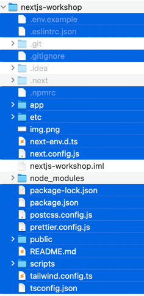

# Intro
Dette kurset går ut på å bli kjent med Next.js rammeverket og er et enkelt kurs å gå gjennom hvis man har litt erfaring med React fra tidligere siden det ikke går unødvendig dypt inn i detaljer. Du vil lære alt fra filoppsett, routing, database-tilkobling med Postgres database til datahenting og mye mer.
Du vil i tillegg bli kjent med bruk av Github som kodebase og teknologier som Vercel som i dette kurset vil bli brukt til oppsett av database, samt kjøre prosjektet ditt på lik linje som openshift.

En av de store fordelene med Next.js rammeverket er at det benytter seg av Server Side Rendering. Noe som vil si at i stedet for at klienten/browseren tar seg av jobben med å generere opp sidene som client-side-rendering gjør, så tar serveren seg av jobben med å generer opp sidene. Dette kalle også pre-rendering og vil si at innholdet er generert på forhånd som gjør at løsningen vil oppleves raskere. Mer om dette og mye annet snadder i kurset.


# Running the development server

Run `npm i` to install the project's packages.

 ```
  $ npm i
 ```

Followed by `npm run dev` to start the development server.

 ```
  $ npm run dev
 ```

`npm run dev` starts your Next.js development server on port 3000. Let's check to see if it's working. Open http://localhost:3000 on your browser.

# Workshop

Kapittel 1, 2 og 3 er allerede gjort i main-branch av dette prosjektet.
Workshopen tar for seg kapittel 4 og utover.

***NB: Skru av zscaler før du starter på workshopen***

https://nextjs.org/learn

### Chapter 4 & 5

Bli kjent med next.js sin router og linking mellom sider

https://nextjs.org/learn/dashboard-app/creating-layouts-and-pages

### Chapter 6
#### Github

1. Opprett github-profil hvis du ikke allerede har gjort dette.
2. Gå inn i repositories og klikk på new knappen for å få laget et github repository
#### Åpne terminalen 
3. Installer github cli -> `brew install gh`
4. `gh auth login`
5. Velg https innlogging og logg inn med webbrowser
6. Clone repositoriet du lagde i github (feks `git clone https://github.com/alokling/nextjs-workshop.git`)
7. Kopier kode og konfig fra bitbucket repo til github repo.

    

8. Add, commit  og push koden til main branchen din i github 

#### Vercel
Koble sammen github og vercel konto for å kunne hoste prosjektet i skyen slik det er beskrevet i kapittel 6.  


